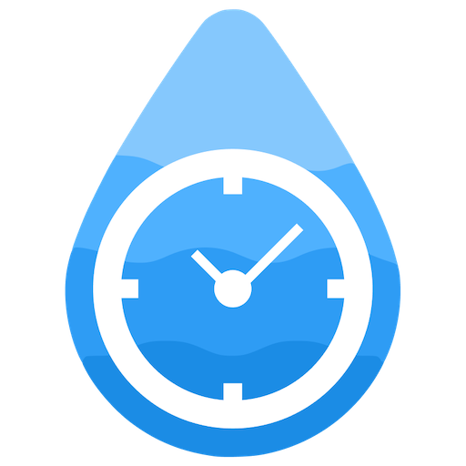
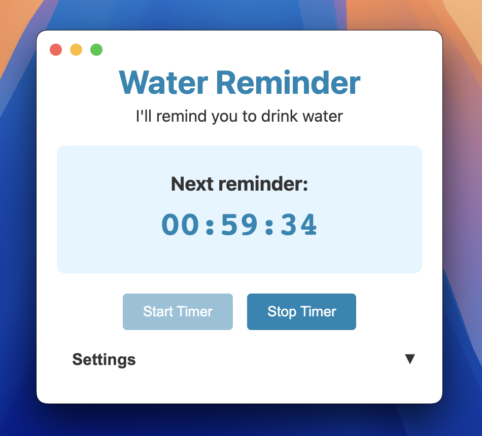

# Water Reminder Application

This is a simple Electron application designed to remind you to drink water every hour. The application features a user-friendly interface and utilizes a timer to send notifications at regular intervals.

## Features

- Hourly reminders to drink water
- Simple and intuitive user interface
- Customizable notification settings

## Project Structure

```
water-reminder
├── src
│   ├── main.js          # Main entry point for the Electron application
│   ├── renderer.js      # Handles UI logic and user interactions
│   ├── index.html       # Main HTML file for the application
│   └── styles.css       # Styles for the application
├── assets
│   └── icons
│       └── app-icon.icns # Application icon for macOS
├── package.json         # Configuration file for npm
├── electron-builder.yml  # Configuration for building the Electron application
└── README.md            # Documentation for the project
```

## Installation

1. Clone the repository:
   ```
   git clone https://github.com/rmarchet/water-reminder.git
   cd water-reminder
   ```

2. Install the dependencies:
   ```
   yarn install
   ```

## Running the Application

To start the application, run the following command:
```
yarn start
```



## Building the Application

To build the application for distribution, use:
```
yarn build
```

## Creating the ICNS file
MacOS Icons can be created starting from the icon.png file:
```
yarn makeicons assets/icons/icon.png assets/icons/app-icon.icns
```

## License

This project is licensed under the MIT License. See the [LICENSE](./LICENSE) file for details.